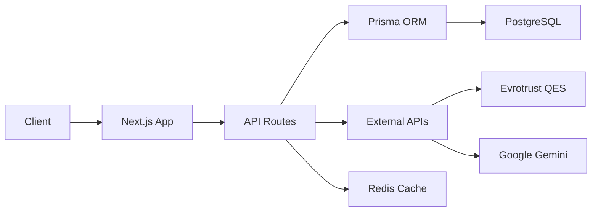

## Overview

BIGPEDAL is built on a modern, scalable architecture using Next.js 14 with the App Router, TypeScript, and a comprehensive set of tools for authentication, AI, and government service integration.

## Tech stack

### Frontend

- **Framework**: Next.js 14 with App Router
- **Language**: TypeScript 5.9
- **Styling**: Tailwind CSS 3.4
- **UI components**: Radix UI primitives
- **Icons**: Lucide React
- **State management**: Zustand
- **Forms**: React Hook Form with Zod validation
- **Data fetching**: SWR

### Backend

- **Runtime**: Node.js
- **API**: Next.js API routes
- **Authentication**: NextAuth.js 4.24
- **Database ORM**: Prisma 5.19
- **Database**: PostgreSQL
- **Caching**: Redis (optional)
- **Rate limiting**: Custom implementation with Redis support

### AI & ML

- **LLM provider**: Google Gemini (gemini-1.5-flash)
- **AI SDK**: Vercel AI SDK
- **Search**: Fuse.js for fuzzy search
- **Document processing**: PDF parsing and OCR-ready analysis

### External integrations

- **QES provider**: Evrotrust (with demo fallback)
- **Email**: Nodemailer with SMTP
- **SMS**: Twilio (optional)
- **Storage**: Vercel Blob for document uploads
- **Analytics**: Vercel Analytics & Speed Insights
- **Error tracking**: Sentry

## Project structure

```
web/
├── app/                    # Next.js App Router
│   ├── (auth)/            # Authentication routes
│   │   ├── login/         # Login with OTP
│   │   └── register/      # User registration
│   ├── api/               # API routes
│   │   ├── auth/          # NextAuth endpoints
│   │   ├── ai/            # CivicAI chat
│   │   ├── qes/           # QES signing
│   │   ├── services/      # Service catalog
│   │   ├── consent/       # Consent management
│   │   └── cron/          # Scheduled jobs
│   ├── dashboard/         # User dashboard
│   ├── navigator/         # Service navigator
│   ├── qes/               # QES interface
│   └── admin/             # Admin panel
├── components/            # React components
│   ├── ui/               # Reusable UI components
│   ├── auth/             # Authentication forms
│   ├── dashboard/        # Dashboard widgets
│   ├── qes/              # QES components
│   └── services/         # Service components
├── lib/                  # Utility libraries
│   ├── auth/             # Auth utilities
│   ├── prisma/           # Database client
│   ├── ai/               # AI integration
│   ├── qes/              # QES providers
│   ├── identity/         # Identity management
│   ├── consent/          # Consent services
│   └── services/         # Service repository
├── prisma/               # Database schema
│   ├── schema.prisma     # Prisma schema
│   └── migrations/       # Database migrations
├── data/                 # Static data
│   └── egov/             # E-gov service definitions
├── tests/                # Test suites
│   ├── unit/             # Vitest unit tests
│   └── e2e/              # Playwright E2E tests
└── public/               # Static assets
```

## Architecture patterns

### API routes

All API routes follow RESTful conventions and are organized by feature:

- `/api/auth/*` - Authentication endpoints (NextAuth)
- `/api/services/*` - Service catalog CRUD
- `/api/ai` - CivicAI chat endpoint
- `/api/qes/*` - QES document signing workflow
- `/api/consent/*` - Consent management
- `/api/cron/*` - Scheduled background jobs

### Authentication flow

1. User submits credentials via `/api/auth/signin`
2. NextAuth validates against Prisma database
3. Optional OTP verification via email
4. JWT token issued with user session
5. Rate limiting applied per IP and EGN

### Data flow



## Security

### Authentication

- Password hashing with bcrypt
- JWT tokens with secure secrets
- Session management via NextAuth
- Rate limiting on sensitive endpoints
- Optional email OTP for step-up authentication

### Data protection

- HTTPS enforced in production
- Environment variables for secrets
- SQL injection prevention via Prisma
- XSS protection via React
- CSRF tokens on forms

### Compliance

- GDPR-compliant consent management
- Audit logging for sensitive operations
- Data encryption at rest (database level)
- Secure document storage with Vercel Blob

## Performance

### Optimization strategies

- Server-side rendering (SSR) for SEO
- Static generation for service pages
- Image optimization with Next.js Image
- Code splitting and lazy loading
- Service worker for offline support
- Redis caching for frequently accessed data

### Monitoring

- Vercel Analytics for page views
- Speed Insights for Core Web Vitals
- Sentry for error tracking
- Custom logging for audit trails

## Scalability

### Horizontal scaling

- Stateless API design
- Database connection pooling
- Redis for distributed caching
- Vercel Edge Functions for global distribution

### Database optimization

- Indexed queries for performance
- Connection pooling via Prisma
- Read replicas for high traffic
- Periodic cleanup jobs via cron

## Development workflow

1. **Local development**: `npm run dev`
2. **Type checking**: `npm run typecheck`
3. **Linting**: `npm run lint`
4. **Testing**: `npm run test`
5. **Build**: `npm run build`
6. **Deploy**: Push to GitHub → Vercel auto-deploy

## Environment configuration

See [Deployment](/deployment) for complete environment variable reference.
